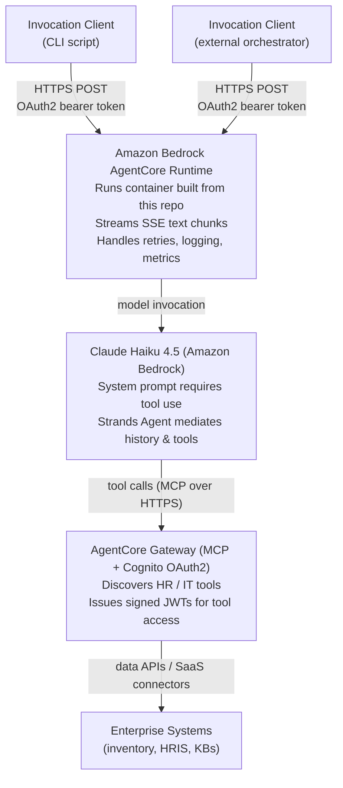

# Architecture Deep Dive

This document explains the moving pieces in the Amazon Bedrock AgentCore Employee Onboarding sample, how they interact, and highlights integration considerations for learners building with Bedrock AgentCore. For setup instructions, see [DEPLOYMENT.md](DEPLOYMENT.md). For troubleshooting, see [TROUBLESHOOTING.md](TROUBLESHOOTING.md).

---

## 1. High-Level Topology



<details>
<summary>Plain-text version of the diagram</summary>

```
           +--------------------+             +---------------------+
           |  Invocation Client |             |  Invocation Client  |
           |  (CLI script)      |             |  (External          |
           |                    |             |   orchestrator)     |
           +----------+---------+             +---------+-----------+
                      |                                 |
                      | HTTPS POST (OAuth2 bearer token)|
                      v                                 v
        +----------------------------------------------------------+
        |           Amazon Bedrock AgentCore Runtime               |
        |  - Runs container built from this repo (onboarding_app)  |
        |  - Streams SSE text chunks back to caller                |
        |  - Handles retries, logging, metrics                     |
        +------------------------+---------------------------------+
                                 |
                                 | model invocation
                                 v
        +----------------------------------------------------------+
        |                Claude Haiku 4.5 (Amazon Bedrock)          |
        |  - System prompt requires tool use before writing sections |
        |  - Strands Agent wrapper mediates history + tools        |
        +------------------------+---------------------------------+
                                 |
                                 | tool calls (MCP over HTTPS)
                                 v
        +----------------------------------------------------------+
        |           AgentCore Gateway (MCP, w/ Cognito OAuth2)     |
        |  - Discovers HR / IT tools                               |
        |  - Issues signed JWTs for tool access                    |
        +------------------------+---------------------------------+
                                 |
                                 | data APIs / SaaS connectors
                                 v
        +----------------------------------------------------------+
        |        Enterprise Systems (inventory, HRIS, KBs)         |
        +----------------------------------------------------------+
```

</details>

---

## 2. Component Responsibilities

### 2.1 Invocation Clients

- **CLI (`src/cli/onboarding_cli.py`)**
  - Loads `.env`, acquires an OAuth2 token, and posts the user prompt to the AgentCore runtime invocation endpoint.
  - Streams Server-Sent Events (SSE) and renders them into sections (Reasoning/Result/Tools) in the terminal.
  - Useful for local validation, regression testing, and scripted demos.

- **External orchestrator (iPaaS, SaaS workflow tool, or custom backend)**
  - Can call the same runtime endpoint using any component that can issue an authenticated HTTP POST.
  - Needs the OAuth2 client ID, client secret, token endpoint, and scope available to the orchestrator (ideally via its native secret storage).
  - Use `content-type: application/json`, `Authorization: Bearer <token>`, and `X-Amzn-Bedrock-AgentCore-Runtime-Session-Id` headers.
  - Expect streaming SSE responses; some orchestrators cannot consume SSE directly and will need buffering and post-processing to extract the final transcript.

> **Gotcha:** Not every HTTP client handles SSE streams gracefully. If the calling system cannot consume SSE, wrap the runtime with an intermediary (API Gateway + Lambda, for example) that aggregates the stream before replying.

### 2.2 Bedrock AgentCore Runtime

- Deployed by `scripts/deploy.sh`; configuration stored in `.bedrock_agentcore.yaml`.
- Hosts `src/agentcore/onboarding_app.py` which defines:
  - `endpoint`: async SSE entrypoint decorated with `@app.entrypoint`, the method invoked by Bedrock.
- Responsibilities:
  - Create the Strands Agent with the configured system prompt and tool list.
  - Stream model events back to callers and relay tool invocation summaries.
  - Retry on `ModelThrottledException` with incremental backoff (2/4/8/12 seconds).
  - Normalize the raw completion into deterministic tagged blocks (Reasoning + Result for each section, plus a trailing ToolTrace block summarizing tool calls).

> **Gotcha:** The runtime enforces `REGION = "us-east-1"`. Ensure Bedrock quotas and models are available in that Region.

### 2.3 Strands Agent + Claude Haiku 4.5

- The Strands wrapper (`StrandsTelemetry`, `SlidingWindowConversationManager`, etc.) handles conversation state, instrumentation, and multi-tool coordination.
- Sonnet is configured with low temperature (0.0) and a strict system prompt that requires the model to call tools before writing each section — it must not fabricate people, hardware, or inventory.
- `_ensure_tools` connects to the AgentCore Gateway via the Strands `MCPClient` (streamable HTTP transport), authenticates with a Cognito client-credentials token, and discovers available MCP tools. Results are cached for the process lifetime. If tools are expected but discovery fails, the function raises rather than silently degrading.
- An `AfterToolCallEvent` hook captures every tool invocation (name, arguments, result summary) so the response can include a trailing `ToolTrace` section that shows learners exactly which tools ran.

> **Gotcha:** If `AGENT_USE_HR_TOOLS=false`, no tools will be discovered and the agent runs without them. The model will state that it could not retrieve data rather than fabricating answers. This is useful for teaching comparisons — invoke once with tools, once without, and observe the difference.

### 2.4 AgentCore Gateway (MCP)

- Discovers tool contracts exposed via the Gateway and issues access tokens through Cognito.
- Configured by deployment scripts; `.env` must contain the Gateway URL and optional Cognito credentials.
- The runtime uses the Gateway to “discover” tools at invocation time; no static tool list is embedded.

> **Gotcha:** `_load_env` only loads `.env` if `AGENTCORE_MCP_URL` is absent in the environment. If your infrastructure injects `AGENTCORE_MCP_URL` but not Cognito credentials, the runtime may miss required env vars. Adjust `_load_env` or your deployment process to ensure all secrets are present.

### 2.5 Enterprise Systems / Tool Backends

- MCP-advertised tools can represent:
  - Inventory lookups (e.g., laptops, monitors, accessories).
  - HRIS data (contacts, departments, start dates).
  - Knowledge base or policy retrievals.
- Gateway enforces OAuth2 so only authenticated agents can call these tools.

> **Gotcha:** Tools should return lightweight JSON/text. Large payloads slow down the agent and amplify token usage.

---

## 3. Request Lifecycle

1. **Token Acquisition**
   - Client uses Cognito client credentials to redeem an access token (`grant_type=client_credentials`).
   - Scope must match `[gateway-name]/invoke`.

2. **Invocation POST**
   - Client sends `{ "message": "<onboarding prompt>" }` to the runtime invocation endpoint.
   - Provide a unique `X-Amzn-Bedrock-AgentCore-Runtime-Session-Id` per conversation.

3. **Streaming Response**
   - Runtime streams SSE `data: { "text": "...chunk..." }`.
   - Chunks include tool notifications, model reasoning, and structured results.

4. **Post-Processing**
   - Clients buffer the stream and parse tags via `parse_sectioned_transcript` utilities or custom logic.
   - Final output includes Reasoning/Result pairs for `it`, `welcome`, `daily`, `first30`, and a `ToolTrace` section listing which MCP tools were called.

---

## 4. Integration Tips

- **Configuration Hygiene**
  - `.env` should include both Gateway and Runtime credentials. Avoid committing secrets.
  - When integrating with an external orchestrator, store secrets in that platform's secret manager rather than configuration files, and inject them at call time.

- **Token Lifetimes**
  - Client credentials tokens are short-lived. Acquire a fresh token per session rather than reusing old tokens.

- **Streaming vs Batch**
  - If downstream systems cannot process SSE, buffer and aggregate before returning (e.g., via Lambda).
  - CLI already demonstrates parsing streaming responses into discrete sections.

- **Error Reporting**
  - Runtime emits human-readable messages (`Notice: Model rate limited...`). Propagate these to operators or logs.
  - Include correlation IDs (session ID) in monitoring dashboards.

- **Testing**
  - Use `make cli PROMPT="onboard Jane Doe as data scientist"` to verify tool integration.
  - Consider unit tests for `_extract_sections` and `parse_sectioned_transcript` to guard against output drift.

---

## 5. Common Pitfalls & Gotchas

| Scenario | Symptom | Resolution |
| --- | --- | --- |
| Missing Cognito env vars | HTTP 401/403 from runtime or gateway | For the container: `deploy.sh` injects `COGNITO_*` env vars via `agentcore deploy --env`. For local invocation: ensure `.env` contains `RUNTIME_CLIENT_ID`, `RUNTIME_CLIENT_SECRET`, `RUNTIME_TOKEN_ENDPOINT`, and `RUNTIME_SCOPE`. |
| Invalid OAuth scope | 400 `invalid_scope` during token request | Scope must match `[gateway-name]/invoke`. Copy from deployment output. |
| SSE client incompatibility | Calling orchestrator step never completes | Use an intermediary service to buffer output (e.g., API Gateway + Lambda) or disable streaming in your runtime fork. |
| Rate limiting | Runtime emits retry notices | The code already backs off; consider raising model quotas or adding caching at the tool layer. |
| Tool not discovered | Runtime raises `RuntimeError` at invocation time | Verify Gateway URL is set (`AGENTCORE_MCP_URL` or `GATEWAY_URL`), Cognito credentials are valid, and the Lambda MCP target is registered. Check `AGENT_USE_HR_TOOLS` is not `false`. |

---

## 6. Further Exploration

- **AgentCore Docs**: Understand runtime/gateway concepts and cloud deployment models.
- **MCP Protocol**: Learn how to advertise tools and secure them with OAuth2.
- **Bedrock Model Tuning**: Experiment with temperature, top-p, or alternate models (e.g., Haiku) for cost-performance tradeoffs.
- **Observability**: Tap into CloudWatch metrics (`/aws/bedrock-agentcore/runtimes/[agent-id]-DEFAULT`) and integrate with dashboards.
- **Extending the Agent**: Modify `_system_prompt` and add additional sections (`Reasoning[benefits]`, etc.) as exercises.

---

By understanding each layer — client, runtime, model, gateway, and tools — you can adapt this blueprint to other enterprise workflows, integrate it with any external orchestrator that can issue an authenticated HTTP POST, and see how Bedrock AgentCore orchestrates complex, tool-aware agents.
