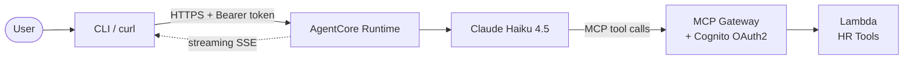

# Amazon Bedrock AgentCore — Employee Onboarding Sample

An end-to-end sample that deploys an AI-powered employee onboarding assistant using Amazon Bedrock AgentCore, demonstrating how to wire up a Strands agent with MCP tools, OAuth2 authentication, and streaming responses.

> **Disclaimer**: This is sample code for demonstration and learning purposes. It is not intended for production use without additional security review. Deploying this sample will incur AWS charges — see [Cost](DEPLOYMENT.md#cost) in the deployment guide.

## What You'll Learn

- **AgentCore Runtime** — how to deploy and invoke a containerized agent on Bedrock AgentCore
- **MCP Gateway** — how agents discover and call tools via the Model Context Protocol
- **Cognito OAuth2** — client-credentials authentication for both the runtime and gateway
- **Strands Agent SDK** — building an agent with a system prompt, tools, and streaming output
- **Lambda as MCP tool backend** — serving tool implementations behind the gateway

## Key Concepts

- **AgentCore Runtime** — an AWS service that hosts and runs your agent as a containerized HTTP endpoint. You deploy code; AgentCore handles scaling, auth, and streaming.
- **AgentCore Gateway** — an MCP-compatible proxy that sits between your agent and its tools. It handles tool discovery, routing, and OAuth2 authentication.
- **MCP (Model Context Protocol)** — an open standard for agents to discover and call tools over HTTP. The agent asks the gateway "what tools do you have?" and gets back schemas it can invoke.
- **Strands Agents SDK** — a Python SDK for building agents with Amazon Bedrock models. It manages conversation history, tool calling, and streaming.
- **SSE (Server-Sent Events)** — a protocol for streaming data from server to client over HTTP. The runtime uses SSE to stream the agent's response token-by-token.
- **ToolTrace** — a custom section appended to every response showing which MCP tools were called, with what arguments, and what they returned. Useful for learning and debugging.
- **OAuth2 client-credentials flow** — a machine-to-machine authentication pattern. Both the CLI (calling the runtime) and the agent (calling the gateway) use it to get access tokens from Cognito.

## How It Works



1. A client (CLI or curl) authenticates via Cognito and sends a prompt to the AgentCore Runtime.
2. The runtime hosts a **Strands agent** that calls **Claude Haiku 4.5** on Amazon Bedrock.
3. Claude decides which **MCP tools** to call (employee directory lookup, IT asset check) and invokes them through the **AgentCore Gateway**.
4. The gateway routes tool calls to a **Lambda function** that returns mock HR data.
5. Claude uses the tool results to write a structured onboarding package — no fabricated data.
6. The response streams back as **Server-Sent Events**, parsed into sections by the client.
7. A trailing **ToolTrace** section shows the learner exactly which tools were called, with what arguments, and what they returned.

For a detailed component-by-component walkthrough, see [ARCHITECTURE.md](ARCHITECTURE.md).

## Quick Start

### Prerequisites

- macOS (Monterey+) or Amazon Linux 2023
- Python 3.10+
- AWS CLI configured with credentials (`aws configure`)
- AWS account with Claude Haiku 4.5 model access enabled in `us-east-1` ([enable here](https://console.aws.amazon.com/bedrock/home?region=us-east-1#/modelaccess))
- `AdministratorAccess` in a sandbox account (see [DEPLOYMENT.md](DEPLOYMENT.md#aws-credentials--permissions) for a scoped policy)

### Deploy

```bash
make deploy
```

Or with a different model:

```bash
make deploy MODEL=us.anthropic.claude-sonnet-4-5-20250929-v1:0
```

This takes ~10-15 minutes on first run. The deploy is **idempotent** — run it again after code changes to update the runtime and Lambda without recreating the gateway or Cognito pool.

### Test

```bash
# Quick smoke test with curl
make smoke-test

# CLI with formatted output
make cli

# Custom prompt
make cli PROMPT="onboard jane doe as software engineer"
```

### Clean Up

```bash
make clean
make verify-clean
```

See [DEPLOYMENT.md § Cleanup](DEPLOYMENT.md#resource-cleanup) for details on what gets removed and what's deliberately left.

## Project Structure

```
├── Makefile                     # ⭐ Start here — make deploy/test/cli/clean
├── src/agentcore/
│   ├── onboarding_app.py       # ⭐ Main agent — start reading here
│   ├── gateway_auth.py         # Cognito OAuth2 token for MCP calls
│   ├── response_parser.py      # Section-tag parser
│   ├── tool_trace.py           # Captures tool calls for ToolTrace output
│   ├── prompts/onboarding.txt  # System prompt (externalized)
│   └── requirements.txt        # Agent runtime dependencies
├── src/cli/
│   └── onboarding_cli.py       # CLI client (OAuth2 + SSE streaming)
├── src/lambda_handler.py        # Lambda MCP handler (deployed by deploy.sh)
├── tools/
│   ├── hr_tools.py             # MCP tool implementations
│   └── mock_data.py            # Fake HR + IT inventory data
├── scripts/
│   ├── deploy.sh               # End-to-end deployment
│   ├── complete_cleanup.sh     # Resource cleanup
│   ├── verify_cleanup.py       # Post-cleanup verification
│   └── test_agentcore_curl.sh  # Curl-based smoke test
├── tests/                      # Unit + property-based tests (pytest)
├── ARCHITECTURE.md             # How it works (deep dive)
├── DEPLOYMENT.md               # Setup, configuration, IAM, cost
├── TROUBLESHOOTING.md          # Common issues + fixes
├── SECURITY.md                 # Security posture + residual risk
└── LICENSE                     # MIT-0
```

## Where to Start Reading

If you're new to AgentCore, read the code in this order:

1. **`src/agentcore/onboarding_app.py`** — the agent itself. See how `_create_agent()` wires up the model, system prompt, and MCP tools. See how `endpoint()` streams responses. See how `_ensure_tools()` discovers tools from the gateway.
2. **`tools/hr_tools.py`** — the MCP tool implementations. Two tools (`employee_lookup`, `it_asset_check`) with schemas and execute methods.
3. **`scripts/deploy.sh`** — how the infrastructure gets created. Follow the `--env` flags to understand how the container gets its configuration.
4. **`src/cli/onboarding_cli.py`** — how a client authenticates and consumes the SSE stream.

### Code Flow

**Deployed (AgentCore Runtime handles the request):**
```
CLI: get_user_token() → collect_transcript() → parse_sectioned_transcript()
                              ↓
Runtime: endpoint() → _create_agent() → _ensure_tools()
                              ↓                    ↓
                     agent.stream_async()    gateway_auth.get_gateway_headers()
                              ↓                    ↓
                     Claude calls tools      MCPClient → Gateway → Lambda
                              ↓
                     format_tool_trace() → SSE stream back to CLI
```

**Key files in call order:**
1. `onboarding_cli.py` — authenticates, calls runtime, parses response
2. `onboarding_app.py` — creates agent, streams response
3. `gateway_auth.py` — fetches Cognito token for MCP calls
4. `tool_trace.py` — captures tool calls via hook
5. `response_parser.py` — parses tagged output into sections

## Running Tests

```bash
make test
```

## Extending This Sample

Once you've deployed and explored the agent, try adding a third MCP tool to deepen your understanding. Here's a guided exercise:

### Exercise: Add an "Office Badge" Tool

**Goal**: Add a tool that provisions a building access badge for the new hire, so the agent can include badge pickup details in the welcome email.

**Steps**:

1. **Add mock data** — In `tools/mock_data.py`, add a `BADGE_TYPES` dict mapping roles to badge levels (e.g., "Engineering" → "Full Access", "Product" → "Standard Access") and a `provision_badge(name, role, location)` function that returns a badge ID and pickup instructions.

2. **Create the tool class** — In `tools/hr_tools.py`, add a `BadgeProvisioningTool` class following the same pattern as `EmployeeDirectoryTool`: a `get_schema()` method returning the MCP tool schema, and an `execute()` method that calls your mock data function. Register it in the `HR_TOOLS` dict.

3. **Update the Lambda handler** — In `src/lambda_handler.py`, add your new tool's distinctive key to `_TOOL_ROUTING` so the gateway can invoke it.

4. **Update the system prompt** — In `src/agentcore/prompts/onboarding.txt`, add your tool to the "Available tools" section and tell the model when to call it.

5. **Redeploy** — Run `make deploy` to push the updated Lambda and container. The agent will discover the new tool automatically via MCP — no hardcoded tool list to update.

6. **Test** — Run `make cli PROMPT="onboard jane doe as software engineer"` and look for badge details in the welcome email section. Check the ToolTrace to confirm the new tool was called.

**What you'll learn**: How MCP tool discovery works end-to-end — from schema definition to Lambda routing to agent invocation. The agent discovers your new tool without any changes to the MCP client code.

## Documentation

| Document | Purpose |
|---|---|
| [ARCHITECTURE.md](ARCHITECTURE.md) | Component deep-dive, request lifecycle, integration tips |
| [DEPLOYMENT.md](DEPLOYMENT.md) | Prerequisites, IAM permissions, configuration, cost, monitoring |
| [TROUBLESHOOTING.md](TROUBLESHOOTING.md) | Common errors and how to fix them |
| [SECURITY.md](SECURITY.md) | Security posture, what this sample is NOT, residual risk |
| [CONTRIBUTING.md](CONTRIBUTING.md) | Contribution guidelines |

## External References

- [Amazon Bedrock AgentCore Developer Guide](https://docs.aws.amazon.com/bedrock-agentcore/latest/devguide/what-is-bedrock-agentcore.html)
- [Strands Agents SDK](https://strandsagents.com/)
- [Model Context Protocol (MCP)](https://modelcontextprotocol.io/)

## License

This project is licensed under the MIT-0 License — see [LICENSE](LICENSE).
